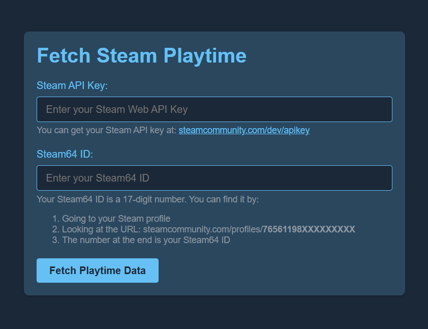
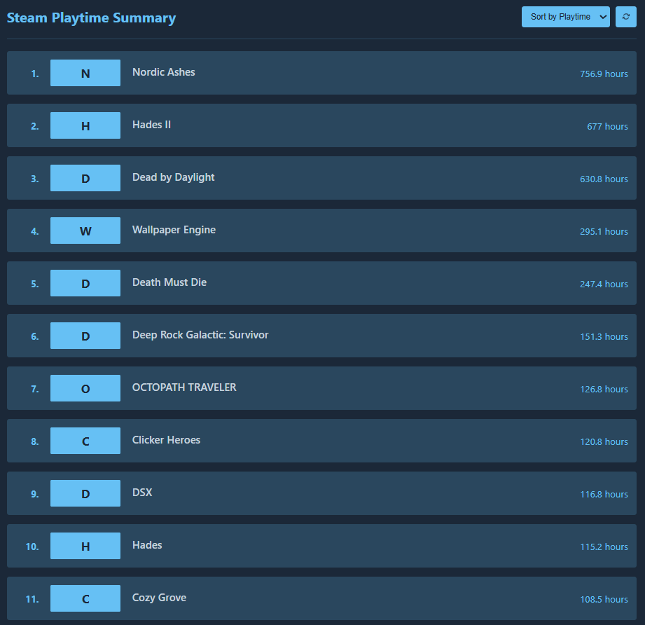

# Fetch Steam GameTime
Fetch Steam GameTime is a simple tool to extract hours spent on your owned game.

## Prerequisites
- Ensure Python 3.13 is installed.
- Run the following in the terminal : `pip install -r requirements.txt`

## How to use
Simply launch `start_server.bat` and you will see your own list:

## Authors
Author : [@hchia93](https://www.github.com/hchia93)
